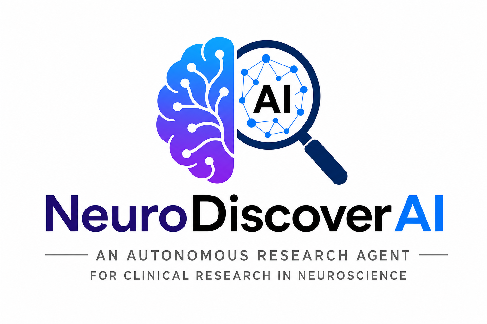

# NeuroDiscover AI by Quorum

<p align="center">
  
</p>

**Quorum** — six agents, one evidence store, ranked commercial discovery. Optional **CUA** (Conclusion Update Agent) grant-proposal engine with a static NIH demo on dashboard **Step 3**.

Agentic system for **commercial development discovery**: continuously ingest literature and trials, surface hidden patient subgroups inside heterogeneous indications, map **subgroup → mechanism → treatment** connections, and rank opportunities by evidence and commercial potential.

**Live docs:** [neurodiscover.github.io](https://neurodiscover.github.io) · **Track:** 02 — Autonomous Research · **Partner framing:** Pfizer Commercial Development Discovery

---

## Quick start

Requires **Python 3.10, 3.11, or 3.12** on macOS, Linux, or Windows.

**pip:**

```bash
git clone https://github.com/kahinimehta/Quorum.git
cd Quorum/neurodiscover
python3 --version          # must be 3.10.x – 3.12.x
pip install -r requirements.txt
cp .env.example .env
make dashboard    # same as: python3 cli.py dashboard
```

**conda (empty environment):**

```bash
git clone https://github.com/kahinimehta/Quorum.git
cd Quorum/neurodiscover
conda env create -f environment.yml
conda activate neurodiscover
cp .env.example .env
make dashboard
```

Opens the URL printed by the launcher (UI on **8080**, API default **5000** with auto-fallback; URL always includes `?api=` so the static server reaches FastAPI). Press **Ctrl+C** to stop.

**Three tabs:** Step 1 configure & run (full-width config + run status strip) · Step 2 discovery results (KPI strip · cohort, rankings, hypotheses; **Audit & provenance** collapsed) · Step 3 static grant proposal (`graded6` — expanded proposal · collapsed **Grant pipeline** + **Pipeline trace & audit**; **Jump to** nav).

**Windows:** use `python cli.py dashboard` if `make` is not installed. **SSH / headless:** add `--no-browser` and open the **`Open:` URL** from launcher output.

Full setup, platform notes, and flags → [`docs/dashboard.md`](docs/dashboard.md) · [Pipeline modes FAQ](https://neurodiscover.github.io/input/#recommended-workflow) · [Debugging](https://neurodiscover.github.io/debugging/)

> **Team live database:** Supabase holds 300+ real evidence rows. Set `SUPABASE_DATABASE_URL` in `.env` and **do not** run `cli.py build` (it truncates all tables). Use `scan` / `pull` to add evidence only.

---

## Start here

| Audience | Document |
|----------|----------|
| Cursor / coding agents | [`AGENTS.md`](AGENTS.md) |
| Humans onboarding | [`CONTRIBUTING.md`](CONTRIBUTING.md) |
| **Project docs (web)** | **[neurodiscover.github.io](https://neurodiscover.github.io)** — Jekyll + Just the Docs ([source](docs/index.md)) |
| Database schema | [`docs/developer-reference/database.md`](docs/developer-reference/database.md) |

**Storage:** SQLite locally, or **Supabase Postgres** for the team shared DB (`SUPABASE_DATABASE_URL`). Table name is **`evidence`**, not `papers`. See [`docs/developer-reference/database.md`](docs/developer-reference/database.md) and [`docs/developer-reference/supabase.md`](docs/developer-reference/supabase.md).

## CLI (without dashboard)

```bash
cd neurodiscover
pip install -r requirements.txt
cp .env.example .env
python3 cli.py build      # local SQLite only — never on team Supabase
python3 cli.py validate
python3 cli.py demo       # safe offline literature-agent run
python3 cli.py pull --disease "your condition" --max 150
```

## Repo layout

Naming: docs and guides use **lowercase kebab-case** (e.g. `docs/developer-reference/agent-io.md`). Root `README.md`, `AGENTS.md`, and `CONTRIBUTING.md` stay uppercase — see [`CONTRIBUTING.md`](CONTRIBUTING.md#file-naming-capitalization).

```
Quorum/
  AGENTS.md
  cua/                   # Optional Agent 6 — NIH grant proposal engine (CLI; Step 3 shows static demo)
  docs/                  # Jekyll site (Just the Docs) → neurodiscover.github.io
  queries.sql
  neurodiscover/
    cli.py               # entry point — run all commands from here
    schema.sql, schema.pg.sql, seed_data.json
    db.py, seed.py, paths.py, db_validate.py
    agents/
      literature_agent.py    # Agent 1 (literature synthesis)
    ingestion/
      grants_pull.py         # NIH RePORTER grants
    validation/
      consistency.py, pubtator.py, spot_check.py, report.py
    scripts/
      export_team_keys.py
    models/
      schemas.py             # Person 2 API DTOs (not DB schema)
    api_server.py            # FastAPI dashboard backend (:5000)
    orchestrator.py          # Agents 1→6 pipeline for POST /api/run-discovery
    frontend/
      index.html             # Dashboard UI
      quickstart.md          # Dashboard quick start
```

Dashboard docs: [`docs/dashboard.md`](docs/dashboard.md) (UI) · [`docs/developer-reference/dashboard-api.md`](docs/developer-reference/dashboard-api.md) (API reference).

## Team

**Quorum** — Alia Merchant · Amy He · Ayelet Peres · Kahini Mehta · William Yakah

Full bios and collaboration map → [`docs/team.md`](docs/team.md) ([docs site](https://neurodiscover.github.io/team/))
