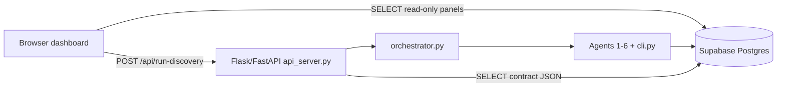

# NeuroDiscover Dashboard Architecture

Single-page dashboard: `neurodiscover/frontend/index.html` (vanilla HTML/CSS/JS, no build step).

## Data flow



## Read path (Supabase JS SDK)

The frontend uses `@supabase/supabase-js` from CDN with the **anon key** for:

| Panel | Tables |
|-------|--------|
| DB status tiles | `evidence` (count by `source_type`), `subgroups` |
| Subgroup chips | `subgroups`, `subgroup_evidence` |
| Recent runs | `agent_outputs` (group by `run_id`) |
| Confidence bars | `treatment_connections` + `subgroups` |
| Top recommendations | `recommendations` |
| Agent timeline | `agent_outputs` |
| Evidence table | `evidence` (paginated) |

If Supabase URL/key are missing (**no keys required**), the UI uses API-only mode:

| Panel | API route |
|-------|-----------|
| DB tiles | `GET /api/stats` |
| Subgroups / confidence bars | `GET /api/discover/parkinsons` |
| Recommendations | `GET /api/recommendations` |
| Recent runs | `GET /api/runs` |
| Agent timeline | `GET /api/agents?run_id=` |
| Evidence table | `GET /api/evidence?offset=&limit=` |

Local setup: unset `SUPABASE_DATABASE_URL`, run `python3 cli.py build` once, then `python3 api_server.py`.

## Write / run path (Flask API)

| Action | Endpoint | Backend |
|--------|----------|---------|
| Run full / demo / scan | `POST /api/run-discovery` | `orchestrator.run()` |

Body: `{ "mode": "demo"|"scan"|"full", "query?", "max_papers?" }`  
Response: `{ "run_id", "recommendations", "steps" }`

Orchestrator:

- **demo / scan** — `cli.py` subprocess (literature only), then agents 2–6 in-process + DB persist
- **full** — `literature_agent.run()` (+ optional grants), then agents 2–6

Agent 1 owns the canonical `run_id` (`scan_state.last_run_id` or latest literature `agent_outputs` row). Agents 2–6 log to the same `run_id`.

## Confidence scoring

On `treatment_connections` and `recommendations`:

```
confidence = evidence_strength × 0.55 + commercial_potential × 0.45
```

| Tier | Rule |
|------|------|
| Prioritize | confidence ≥ 80 |
| Monitor | 65 ≤ confidence < 80 |
| Reject | confidence < 65 |

In-process agents score 0–10; the orchestrator scales to **0–100** when writing to the DB.

## Related docs

- API JSON shapes: [`BACKEND_QUERIES.md`](BACKEND_QUERIES.md)
- Agent writes: [`AGENT_IO.md`](AGENT_IO.md)
- Local setup: [`../neurodiscover/frontend/QUICKSTART.md`](../neurodiscover/frontend/QUICKSTART.md)
