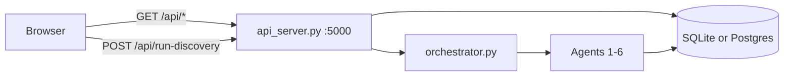

# Dashboard

Single-page UI at `neurodiscover/frontend/index.html` — vanilla HTML/CSS/JS, no build step.

---

## Quick start

**Python 3.10, 3.11, or 3.12** · macOS, Linux, Windows · `make dashboard` = `python3 cli.py dashboard`

**pip:**

```bash
git clone https://github.com/kahinimehta/Quorum.git
cd Quorum/neurodiscover
python3 --version          # must be 3.10.x – 3.12.x
pip install -r requirements.txt
cp .env.example .env
make dashboard # use `python3 cli.py dashboard` for Windows
```

**conda (empty environment):**

```bash
git clone https://github.com/kahinimehta/Quorum.git
cd Quorum/neurodiscover
conda env create -f environment.yml
conda activate neurodiscover
cp .env.example .env
make dashboard # use `python3 cli.py dashboard` for Windows
```

Opens the URL printed by the launcher (default UI **http://127.0.0.1:8080** with `?api=http://127.0.0.1:5000`). Use `--no-browser` to skip auto-open and copy the **`Open:`** line. Press **Ctrl+C** to stop API + UI.

The launcher will:

1. Install dependencies (unless `--skip-install`)
2. Build local `neurodiscover.db` if missing (skipped when `SUPABASE_DATABASE_URL` is set)
3. Run one pipeline pass before serving (unless `--skip-pipeline`):
   - **Local SQLite:** **Demo sample** with `max_papers=10`
   - **Team Supabase:** **Rescore DB** (`agents-only`) on all existing evidence
4. Start FastAPI (default **5000**, auto-fallback if busy) and static UI on **8080** — launcher **always** opens UI with `?api=http://127.0.0.1:{resolved_api_port}`

### Platform notes

| Platform | Tip |
|----------|-----|
| **Windows** | `make` often unavailable — use `python cli.py dashboard` |
| **Windows** | `./dashboard` requires Git Bash or WSL |
| **Linux / WSL / SSH / headless** | `--no-browser` then open the **`Open:` URL** from launcher output (includes `?api=`) |
| **macOS** | Port 5000 sometimes taken by **AirPlay Receiver** — `--port-api 5001 --port-ui 8081` or disable AirPlay |
| **Any OS** | Python must be **3.10–3.12**. Re-run `pip install -r requirements.txt` or `conda env update -f environment.yml --prune` if imports fail |
| **Conda** | `conda activate neurodiscover` before starting the dashboard |

### Useful flags

```bash
python3 cli.py dashboard --no-browser      # do not auto-open browser
python3 cli.py dashboard --skip-install    # skip pip install (deps already installed)
python3 cli.py dashboard --skip-pipeline   # start servers only
python3 cli.py dashboard --fresh           # rebuild local SQLite DB
python3 cli.py dashboard --port-api 5001 --port-ui 8081
```

See also [Debugging](debugging) if the dashboard fails to start.

## Team Supabase

Set `SUPABASE_DATABASE_URL` in `.env` (Session pooler URI). Then:

```bash
make dashboard
```

Same command as local — the launcher detects Postgres, **skips `build`**, and runs **agents-only** on the full evidence corpus so connections, scores, and recommendations populate before the UI opens. Never run `cli.py build` on the team DB.

Optional browser keys (`SUPABASE_URL` + `SUPABASE_ANON_KEY`) enable direct read-only Supabase queries from the UI; the default path is still FastAPI → Postgres.

## Data flow

**Default (no browser Supabase keys):** UI → FastAPI (`api_server.py` :5000) → SQLite or team Postgres.

**Optional:** set `SUPABASE_URL` + `SUPABASE_ANON_KEY` in the page or `localStorage` for direct read-only Supabase queries.



## Demo tour (≈3 min)

| Step | Tab | What to show |
|------|-----|--------------|
| 1 | **Configure & Run** | Demo mode, max papers 10, run button — global run status strip shows progress |
| 2 | **Discovery Results** | **Ideal candidate profiles** · ranked outputs · research hypotheses first; then pipeline diagram; expand **Audit & provenance** for agent trace + evidence table |
| 3 | **Grant Proposal** (last tab, static) | Hero KPIs → **The proposal** fully expanded at top (above data loop) → one click on **Pipeline trace & audit** reveals all pipeline/audit sections |

Tabs run left-to-right: **Configure & Run** · **Discovery Results** · **Grant Proposal**. Step 3 is **not run-scoped** — same `graded6` demo regardless of Step 2.

**Collapsed by default (demo-friendly):** Step 2 **Audit & provenance** · Step 3 **Pipeline trace & audit** (Jump to → **Supporting details** opens it). Rankings and the NIH proposal body stay visible without extra clicks.

{: .important }
**Stage safety:** Pre-run `make dashboard` before presenting. Use **demo** mode — no live PubMed pull on stage. See [Debugging — safe demo checklist](debugging#safe-demo-checklist-stage).

## UI layout

| Area | Content |
|------|---------|
| Header | DB status, evidence totals, ideal candidate profiles badge, run id |
| KPI strip | Per-type counts; **this run** vs **in database** |
| Run status | Ready / Running / Complete / Partial / Failed |
| **Step 1** | Configure & run — **pipeline mode** (Rescore / Demo / Incremental scan / Full live pull), disease, max papers, extraction; **Recent runs** table with human-readable mode labels |
| **Step 2** | **Pipeline complete** badge beside title; **ideal candidate profiles**, ranked outputs, and research hypotheses panels first; discovery pipeline diagram; **Audit & provenance** collapsed by default (agent trace + evidence preview inside) |
| **Step 3** | **Grant Proposal** — **static** bundled `graded6` NIH R01 demo (never changes with Step 1/2 `run_id`). Hero KPIs + audit status chips; **The proposal** fully expanded at the top (above the data loop); all pipeline/audit sections behind **one** collapsed **Pipeline trace & audit** block (single click — no nested collapses). **Jump to** scrolls to Proposal or opens supporting details. **Run a live grant proposal (CLI)** is collapsible. Live runs: `python -m cua.nih.run_db` (see [Conclusion Update](workflow/conclusion-update#cua-package--nih-grant-proposal)) |

### Step 3 — report structure

| Jump to | Layout | Content |
|---------|--------|---------|
| **Proposal** | Always visible (first in report) | NIH R01 proposal — significance, innovation, three aims |
| **Supporting details** | One collapsed group | Data loop · contract · dropped args · revise rounds · booster · A/B outcomes · raw trace · audit · ingestion (all expanded inside the group) |

Step 3 is **not run-scoped** — it always shows bundled `graded6`, independent of Step 1/2 `run_id`. See [Conclusion Update — CUA package](workflow/conclusion-update#cua-package--nih-grant-proposal) for live CLI runs.

#### Tab shell (outside the report)

| Area | What it is |
|------|------------|
| **Static demo** badge + About | Fixed `graded6` sample (400-paper corpus → 60 verified papers) |
| **Corpus vs verified papers** | Intro + expandable **What are corpus papers & verified papers?** — see [below](#corpus-vs-verified-papers) |
| **F1 / F2 / F3 guide** | Always-visible intro + **1–9 score scale** (1–4 needs revision · 5–6 meets threshold · 7–9 strong); KPIs show `n/9`; revise loop typically stops at F1/F2 ≥ 5; expandable cards explain each dimension |
| **Run at a glance** | KPIs: **corpus** (full pull) · **verified papers** (selected for drafting) · citations · **Critic F1/F2/F3**; expandable guides for corpus and F-scores; audit status chips |
| **Jump to** | **Proposal** scrolls to NIH text; **Supporting details** opens the collapsed block |
| **Run a live grant proposal (CLI)** | Collapsed `python -m cua.nih.run_db` instructions (writes local files only) |

#### The proposal (always visible)

The deliverable NIH R01 text: **central hypothesis**, **significance**, **innovation**, and **three aims** (each with hypothesis, approach, expected outcomes, pitfalls, and corpus citations). This is what the CUA pipeline was building; everything below is provenance.

#### Pipeline trace & audit (one collapsed group)

Expand **Pipeline trace & audit** (or Jump to → **Supporting details**) for nine sections:

| Section | What it shows |
|---------|----------------|
| **The data loop** | Interactive diagram: roles (Ingestion → Planner → Synthesizer → … → Proposal), arrows, hover tooltips, captured content per step |
| **The contract** | Blueprint Planner’s **obligations** — the grading checklist writers and the Critic use (see below) |
| **Explored & dropped** | **Best-of-N** at the opening: multiple F1 pitches, one chosen, losers kept for audit |
| **The loop, round by round** | Revise rounds: citation gate (orphans dropped), F1/F2/F3 scores, revise vs pass |
| **The road not taken** | **Booster**: mines papers the writer never saw to harden pitfalls and outcomes |
| **Outcomes (A/B)** | Blinded judge: did the booster lift F2 rigor? (modest, honest effect sizes) |
| **Raw trace** | Chronological event log — every LLM and code step per round |
| **Audit** | Trust record: citation integrity, obligation coverage, overclaim check vs evidence grades |
| **Ingestion** | Corpus funnel (e.g. 400 → 60 shown); what was held back feeds the booster |

##### The contract (plain language)

An NIH grant is a **structured argument** scored on a rubric. Before drafting, the **Blueprint Planner** turns that rubric into a **checklist** (~21 obligations in `graded6`) — that checklist is **the contract**, not the proposal text.

| Group | Meaning | Example obligation |
|-------|---------|-------------------|
| **F1** | Why this project? (gap, hypothesis, innovation) | Significance names a **specific** barrier and cites the corpus |
| **F2** (per aim) | How you will do the work | Each aim needs testable hypothesis, concrete methods, pitfalls, expected outcomes |
| **F3** (per aim) | Can the team do it? | Surface assumed expertise, equipment, access |
| **X** | Honesty rules | Every cite must exist in corpus; claims cannot exceed evidence grade |

Writers satisfy the contract; the **Critic** scores against it; the **Audit** reports satisfied vs at-risk obligations.

##### Corpus vs verified papers

Tab 3 **Run at a glance** shows two ingestion counts from `GET /api/cua/demo` → `ingestion.corpus_n` and `ingestion.top_k`:

| KPI | Meaning | `graded6` demo |
|-----|---------|----------------|
| **Corpus papers** | Full evidence set CUA pulled from the database for this run — the citation gate (inv-1) checks every cited ID against this full set | **400** |
| **Verified papers** | Ingestion’s **`top_k`** — clustered by similar `key_finding`, ranked for topic relevance, diversified (`per_cluster_cap`) so one finding doesn’t dominate. The **Synthesizer and revisers draft from this verified slice only** | **60** |

**ID-preserving:** clustering narrows what drafters *read*; it does **not** delete sources from the corpus. Papers outside the verified set can still feed the **F2 Rigor Booster**. Expand **Ingestion** inside **Pipeline trace & audit** for the full funnel audit.

##### Critic score scale (F1 / F2 / F3)

Tab 3 **Run at a glance** shows **Critic F1**, **F2**, and **F3** as `n/9`. Each dimension uses the same integer scale:

| | Value |
|---|--------|
| **Minimum** | **1** (weak — major revision needed) |
| **Maximum** | **9** (exceptional) |

| Range | Meaning | Dashboard color |
|-------|---------|-----------------|
| **1–4** | Needs revision | Red |
| **5–6** | Meets revise-loop threshold | Amber |
| **7–9** | Strong | Green |

The revise loop typically stops when **F1 ≥ 5** and **F2 ≥ 5** (or max rounds). In the bundled `graded6` demo, final scores are **F1 = 7**, **F2 = 5**, **F3 = 6**.

##### Discovery confidence scale (Steps 1–2)

Ranked outputs use a separate **0–100** confidence score (not the 1–9 Critic scale):

| | Value |
|---|--------|
| **Minimum** | **0** |
| **Maximum** | **100** |

```
confidence = evidence_strength × 0.55 + commercial_potential × 0.45
```

Both inputs are stored **0–100** on `treatment_connections`. Tiers: **Prioritize** ≥ 80 · **Monitor** 65–79 · **Reject** &lt; 65. See [Output examples — scoring](output#recommendations-agent-6).

##### Best-of-N (plain language)

At the start, the **Synthesizer** writes **N independent opening arguments** (four in `graded6`). The **Selection Scorer** ranks them on F1 and picks **one winner**. Rejected pitches never enter the proposal but appear under **Explored & dropped** with the scorer’s rationale — like keeping losing bids in the file for transparency.

Timestamps display in **US Eastern** (`America/New_York`).

## API routes used by the UI

| Panel | Route |
|-------|--------|
| DB / KPI tiles | `GET /api/stats` |
| Subgroups / connections | `GET /api/discover/parkinsons` (legacy path; indication-agnostic) |
| Recommendations | `GET /api/recommendations?run_id=` |
| Recent runs | `GET /api/runs` |
| Agent trace | `GET /api/agents?run_id=` |
| Run completion | `GET /api/run-discovery/status?run_id=` |
| Per-run KPIs | `GET /api/run-stats?run_id=` |
| Evidence table | `GET /api/evidence?offset=&limit=` |
| Synthetic patients | `GET /api/synthetic-cohort?run_id=` |
| Grant proposal (Step 3) | `GET /api/cua/demo` · report inlined from `GET /cua-demo/graded6.html` |

## Run discovery

```bash
curl -s -X POST http://127.0.0.1:5000/api/run-discovery \
  -H 'Content-Type: application/json' \
  -d '{"mode":"demo","max_papers":10}'
```

Default response: `{ "run_id", "status": "running", "accepted": true }`. Poll `GET /api/run-discovery/status?run_id=` or add `"wait": true` for the full payload. See [Backend queries — POST /api/run-discovery](developer-reference/backend-queries#post-apirun-discovery) and [Output examples](output).

### Recent runs — mode labels

The **Recent runs** table and `/api/runs` distinguish all four pipeline modes with stable labels (not generic `SCAN` / `FULL`):

| API `mode` | UI label | Evidence column example |
|------------|----------|-------------------------|
| `agents-only` | Rescore DB | `110 rows rescored (no pull)` |
| `demo` | Demo sample | `10 papers (demo sample)` |
| `scan` | Incremental scan | `150 searched · +3 new · 147 skipped · incremental` |
| `full` | Full live pull | `150 papers · 5 trials · +12 stored · 138 skipped` |

Literature agent trace summaries are mode-specific: **Incremental scan complete: …** vs **Full live pull complete: …** (see `pipeline_mode.py`).

## Related developer docs

- [Dashboard API reference](developer-reference/dashboard-api) — API reference
- [Backend queries](developer-reference/backend-queries) — SQL + JSON shapes
- [API endpoints](developer-reference/api-endpoints) — route list
