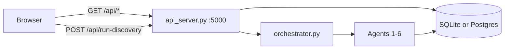

# Dashboard

Single-page UI at `neurodiscover/frontend/index.html` — vanilla HTML/CSS/JS, no build step.

---

## Quick start

```bash
cd neurodiscover
make dashboard
```

Opens **http://127.0.0.1:8080** (`--no-browser` to skip). Press **Ctrl+C** to stop API + UI.

## Data flow

**Default (no browser Supabase keys):** UI → FastAPI (`api_server.py` :5000) → SQLite or team Postgres.

**Optional:** set `SUPABASE_URL` + `SUPABASE_ANON_KEY` in the page or `localStorage` for direct read-only Supabase queries.



## UI layout

| Area | Content |
|------|---------|
| Header | DB status, evidence totals, synthetic cohort badge, run id |
| KPI strip | Per-type counts; **this run** vs **in database** |
| Run status | Ready / Running / Complete / Partial / Failed |
| **Step 1** | Configure & run — mode, max papers, extraction options |
| **Step 2** | Pipeline diagram, synthetic cohort, ranked outputs, audit trace |

Timestamps display in **US Eastern** (`America/New_York`).

## API routes used by the UI

| Panel | Route |
|-------|--------|
| DB / KPI tiles | `GET /api/stats` |
| Subgroups / connections | `GET /api/discover/parkinsons` |
| Recommendations | `GET /api/recommendations?run_id=` |
| Recent runs | `GET /api/runs` |
| Agent trace | `GET /api/agents?run_id=` |
| Evidence table | `GET /api/evidence?offset=&limit=` |
| Synthetic patients | `GET /api/synthetic-cohort?run_id=` |

## Run discovery

```bash
curl -s -X POST http://127.0.0.1:5000/api/run-discovery \
  -H 'Content-Type: application/json' \
  -d '{"mode":"demo","max_papers":5}'
```

See [Output examples](output) for the response shape.

## Related developer docs

- [Dashboard API reference](DASHBOARD) — full API contract
- [Backend queries](BACKEND_QUERIES) — SQL + JSON shapes
- [API endpoints](PERSON2_API_ENDPOINTS) — route list
