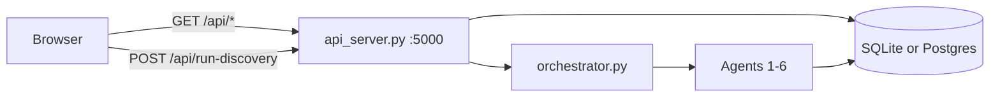

# Dashboard

Single-page UI at `neurodiscover/frontend/index.html` — vanilla HTML/CSS/JS, no build step.

---

## Quick start

**Python 3.10, 3.11, or 3.12** · macOS, Linux, Windows · `make dashboard` = `python3 cli.py dashboard`

**pip:**

```bash
git clone https://github.com/kahinimehta/Quorum.git
cd Quorum/neurodiscover
python3 --version          # must be 3.10.x – 3.12.x
pip install -r requirements.txt
cp .env.example .env
make dashboard
```

**conda (empty environment):**

```bash
git clone https://github.com/kahinimehta/Quorum.git
cd Quorum/neurodiscover
conda env create -f environment.yml
conda activate neurodiscover
cp .env.example .env
make dashboard
```

Equivalents:

```bash
python3 cli.py dashboard
./dashboard                         # bash script — Git Bash / WSL on Windows
```

Opens **http://127.0.0.1:8080** in your default browser. Use `--no-browser` to skip auto-open. Press **Ctrl+C** to stop API + UI.

The launcher will:

1. Install dependencies (unless `--skip-install`)
2. Build local `neurodiscover.db` if missing (skipped when `SUPABASE_DATABASE_URL` is set)
3. Run one pipeline pass before serving (unless `--skip-pipeline`):
   - **Local SQLite:** **Demo sample** with `max_papers=10`
   - **Team Supabase:** **Rescore DB** (`agents-only`) on all existing evidence
4. Start FastAPI on **5000** and static UI on **8080**

### Platform notes

| Platform | Tip |
|----------|-----|
| **Windows** | `make` often unavailable — use `python cli.py dashboard` |
| **Windows** | `./dashboard` requires Git Bash or WSL |
| **Linux / WSL / SSH / headless** | `--no-browser` then open `http://127.0.0.1:8080` manually |
| **macOS** | Port 5000 sometimes taken by **AirPlay Receiver** — `--port-api 5001 --port-ui 8081` or disable AirPlay |
| **Any OS** | Python must be **3.10–3.12**. Re-run `pip install -r requirements.txt` or `conda env update -f environment.yml --prune` if imports fail |
| **Conda** | `conda activate neurodiscover` before starting the dashboard |

### Useful flags

```bash
python3 cli.py dashboard --no-browser      # do not auto-open browser
python3 cli.py dashboard --skip-pipeline   # start servers only
python3 cli.py dashboard --fresh           # rebuild local SQLite DB
python3 cli.py dashboard --port-api 5001 --port-ui 8081
```

See also [Debugging](debugging) if the dashboard fails to start.

## Team Supabase

Set `SUPABASE_DATABASE_URL` in `.env` (Session pooler URI). Then:

```bash
make dashboard
```

Same command as local — the launcher detects Postgres, **skips `build`**, and runs **agents-only** on the full evidence corpus so connections, scores, and recommendations populate before the UI opens. Never run `cli.py build` on the team DB.

Optional browser keys (`SUPABASE_URL` + `SUPABASE_ANON_KEY`) enable direct read-only Supabase queries from the UI; the default path is still FastAPI → Postgres.

## Data flow

**Default (no browser Supabase keys):** UI → FastAPI (`api_server.py` :5000) → SQLite or team Postgres.

**Optional:** set `SUPABASE_URL` + `SUPABASE_ANON_KEY` in the page or `localStorage` for direct read-only Supabase queries.



## UI layout

| Area | Content |
|------|---------|
| Header | DB status, evidence totals, synthetic cohort badge, run id |
| KPI strip | Per-type counts; **this run** vs **in database** |
| Run status | Ready / Running / Complete / Partial / Failed |
| **Agent pipeline stepper** | On **Step 1** sidebar during a run: weighted progress bar, per-agent **Running…** / **Done**, literature sub-progress from live commits (polled every ~500ms). Step 2 shows results only — no duplicate stepper. |
| **Step 1** | Configure & run — **pipeline mode** (Rescore / Demo / Incremental scan / Full live pull), disease, max papers, extraction; **Recent runs** table with human-readable mode labels |
| **Step 2** | **This run** report (settings + signature + support table), pipeline diagram, synthetic cohort, ranked outputs, audit trace |

Timestamps display in **US Eastern** (`America/New_York`).

## API routes used by the UI

| Panel | Route |
|-------|--------|
| DB / KPI tiles | `GET /api/stats` |
| Subgroups / connections | `GET /api/discover/parkinsons` (legacy path; indication-agnostic) |
| Recommendations | `GET /api/recommendations?run_id=` |
| Recent runs | `GET /api/runs` |
| Agent trace | `GET /api/agents?run_id=` |
| Evidence table | `GET /api/evidence?offset=&limit=` |
| Synthetic patients | `GET /api/synthetic-cohort?run_id=` |

## Run discovery

```bash
curl -s -X POST http://127.0.0.1:5000/api/run-discovery \
  -H 'Content-Type: application/json' \
  -d '{"mode":"demo","max_papers":10}'
```

See [Output examples](output) for the response shape.

### Recent runs — mode labels

The **Recent runs** table and `/api/runs` distinguish all four pipeline modes with stable labels (not generic `SCAN` / `FULL`):

| API `mode` | UI label | Evidence column example |
|------------|----------|-------------------------|
| `agents-only` | Rescore DB | `110 rows rescored (no pull)` |
| `demo` | Demo sample | `10 papers (demo sample)` |
| `scan` | Incremental scan | `150 searched · +3 new · 147 skipped · incremental` |
| `full` | Full live pull | `150 papers · 5 trials · +12 stored · 138 skipped` |

Literature agent trace summaries are mode-specific: **Incremental scan complete: …** vs **Full live pull complete: …** (see `pipeline_mode.py`).

## Related developer docs

- [Dashboard API reference](developer-reference/dashboard-api) — API reference
- [Backend queries](developer-reference/backend-queries) — SQL + JSON shapes
- [API endpoints](developer-reference/api-endpoints) — route list
