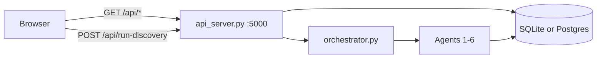

# Dashboard

Single-page UI at `neurodiscover/frontend/index.html` — vanilla HTML/CSS/JS, no build step.

---

## Quick start

**Cross-platform:** macOS, Linux, and Windows (with Python 3). `make dashboard` is equivalent to `python3 cli.py dashboard` — not Mac-only.

```bash
git clone https://github.com/kahinimehta/Quorum.git
cd Quorum/neurodiscover
pip install -r requirements.txt   # first time only
make dashboard
```

Equivalents:

```bash
python3 cli.py dashboard
./dashboard                         # bash script — Git Bash / WSL on Windows
```

Opens **http://127.0.0.1:8080** in your default browser. Use `--no-browser` to skip auto-open. Press **Ctrl+C** to stop API + UI.

The launcher will:

1. Install dependencies (unless `--skip-install`)
2. Build local `neurodiscover.db` if missing (skipped when `SUPABASE_DATABASE_URL` is set)
3. Run one offline **demo** pipeline pass (unless `--skip-pipeline`)
4. Start FastAPI on **5000** and static UI on **8080**

### Platform notes

| Platform | Tip |
|----------|-----|
| **Windows** | `make` often unavailable — use `python cli.py dashboard` |
| **Windows** | `./dashboard` requires Git Bash or WSL |
| **Linux / WSL / SSH / headless** | `--no-browser` then open `http://127.0.0.1:8080` manually |
| **macOS** | Port 5000 sometimes taken by **AirPlay Receiver** — `--port-api 5001 --port-ui 8081` or disable AirPlay |
| **Any OS** | Ports busy? `--port-api 5001 --port-ui 8081` |

### Useful flags

```bash
python3 cli.py dashboard --no-browser      # do not auto-open browser
python3 cli.py dashboard --skip-pipeline   # start servers only
python3 cli.py dashboard --fresh           # rebuild local SQLite DB
python3 cli.py dashboard --port-api 5001 --port-ui 8081
```

See also [Debugging](debugging) if the dashboard fails to start.

## Data flow

**Default (no browser Supabase keys):** UI → FastAPI (`api_server.py` :5000) → SQLite or team Postgres.

**Optional:** set `SUPABASE_URL` + `SUPABASE_ANON_KEY` in the page or `localStorage` for direct read-only Supabase queries.



## UI layout

| Area | Content |
|------|---------|
| Header | DB status, evidence totals, synthetic cohort badge, run id |
| KPI strip | Per-type counts; **this run** vs **in database** |
| Run status | Ready / Running / Complete / Partial / Failed |
| **Step 1** | Configure & run — mode, max papers, extraction options |
| **Step 2** | Pipeline diagram, synthetic cohort, ranked outputs, audit trace |

Timestamps display in **US Eastern** (`America/New_York`).

## API routes used by the UI

| Panel | Route |
|-------|--------|
| DB / KPI tiles | `GET /api/stats` |
| Subgroups / connections | `GET /api/discover/parkinsons` (legacy path; indication-agnostic) |
| Recommendations | `GET /api/recommendations?run_id=` |
| Recent runs | `GET /api/runs` |
| Agent trace | `GET /api/agents?run_id=` |
| Evidence table | `GET /api/evidence?offset=&limit=` |
| Synthetic patients | `GET /api/synthetic-cohort?run_id=` |

## Run discovery

```bash
curl -s -X POST http://127.0.0.1:5000/api/run-discovery \
  -H 'Content-Type: application/json' \
  -d '{"mode":"demo","max_papers":5}'
```

See [Output examples](output) for the response shape.

## Related developer docs

- [Dashboard API reference](developer-reference/dashboard-api) — full API contract
- [Backend queries](developer-reference/backend-queries) — SQL + JSON shapes
- [API endpoints](developer-reference/api-endpoints) — route list
