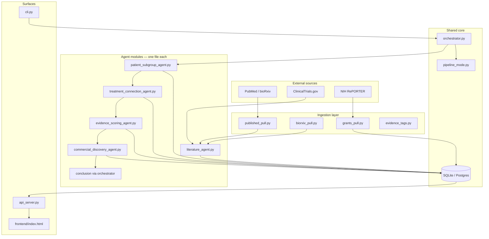

# Design & engineering

How NeuroDiscover is structured for **modularity**, **team parallel work**, and **production-grade** behavior — beyond the one-page trade-offs in [Architecture decisions](decisions).

---

## Design principles

| Principle | What it means in this repo |
|-----------|----------------------------|
| **Modularity** | Each agent is a separate module with a single responsibility; ingestion, orchestration, API, and UI are independent packages. |
| **Contract-first** | SQL schema + docs ([Database schema](developer-reference/database), [Agent I/O](developer-reference/agent-io)) define what agents may read/write — not ad hoc JSON between teammates. |
| **Blackboard, not message passing** | Agents communicate through tables (`evidence`, `subgroups`, `treatment_connections`, …), not direct Python calls. |
| **Auditability** | Every pipeline run appends to `agent_outputs` with a shared `run_id`; recommendations cite real `source_id` values. |
| **Safe iteration** | Incremental scan, demo mode, and agents-only rescoring let you develop without repeated full PubMed pulls. |
| **Indication-agnostic core** | Disease/query are runtime parameters; Parkinson's is the demo default, not a hard-coded code path. |

---

## Modular architecture



### Layer responsibilities

| Layer | Location | Role |
|-------|----------|------|
| **Ingestion** | `neurodiscover/ingestion/` | PubMed pull, preprints, grants, shared tag inference — no agent scoring logic |
| **Agents** | `neurodiscover/agents/` | Pure(ish) functions: read rows → return structured dict → orchestrator persists |
| **Orchestrator** | `orchestrator.py` | Mode routing (demo / scan / full / agents-only), run_id, commits after each agent, run stats |
| **API** | `api_server.py` | HTTP contract for dashboard; no business logic duplicated from agents |
| **Dashboard** | `frontend/index.html` | Vanilla JS UI; polls `agent_outputs` for live pipeline progress on Step 1 |
| **Contracts** | `schema.sql`, `schema.pg.sql`, `docs/developer-reference/` | Team source of truth for columns and I/O |

Agents **do not import each other**. Agent 3 never calls Agent 2 — both read `evidence` through orchestrator-supplied rows. That lets Person 4 teammates implement agents in parallel without merge conflicts in shared classes.

---

## Database blackboard pattern

The pipeline is intentionally **sequential in business logic** but **decoupled in code**:

1. Agent 1 writes `evidence`, `subgroup_evidence`, `scan_state`
2. Agent 2 writes `subgroups`
3. Agent 3 writes `treatment_connections`, `connection_evidence`
4. Agents 4–5 update score columns on `treatment_connections`
5. Agent 6 writes `recommendations`

The FastAPI backend and dashboard **only read** these tables — they never embed agent rules. Adding a seventh agent means a new module + schema columns documented in [Agent I/O](developer-reference/agent-io), not rewriting the UI.

---

## Technical proficiency highlights

### Dual-database support

One codebase runs against **local SQLite** (hackathon laptop) or **Supabase Postgres** (team shared DB) via `db.py` and parallel schema files. Same agents, same API — connection string switches the backend.

### Structured extraction pipeline

Literature rows are **distilled** to a fixed column set (`subgroup`, `mechanism`, `treatment`, `key_result`, …), not stored as opaque LLM blobs. Extraction backends are pluggable:

| Backend | Use case |
|---------|----------|
| **Nebius** | Cloud LLM (default for live demos) |
| **Ollama** | Local LLM |
| **none** | Metadata-only / incremental scan without re-extraction cost |

Post-pull **validation** (`validation/consistency.py`, optional PubTator spot-check) catches hallucinated fields before they enter scoring.

### Incremental vs full pull (by design)

| Mode | Engineering intent |
|------|-------------------|
| **Incremental scan** | Skip LLM for known `source_id`s; cheap repeated runs; trace tagged `Incremental scan complete` |
| **Full live pull** | New PubMed + trials + optional preprints, full text, grants; trace tagged `Full live pull complete` |

Mode detection and UI labels live in `pipeline_mode.py` so runs history, API, and dashboard stay consistent. See [Dashboard — Recent runs](dashboard#recent-runs--mode-labels).

### Live pipeline observability

Long literature pulls **commit progress rows** to `agent_outputs` during processing (not only at the end). The dashboard polls every ~500ms and drives a **weighted progress bar** (literature ≈45%, downstream agents ≈11% each) — suitable for 150+ paper scans without a fake progress animation.

### Scoring that responds to evidence

Confidence is not a static lookup table. `evidence_strength` and `commercial_potential` **scale with per-connection support counts** so new pulls move rankings when the corpus grows. Formula:

```
confidence = evidence_strength × 0.55 + commercial_potential × 0.45
```

### Operational safety

- **`cli.py build` blocked on team DB** — documented everywhere; truncates live Supabase
- **Synthetic cohort generated, not stored** — HIPAA-safe demo visuals without PHI in Postgres
- **No invented PMIDs/NCT ids** — extraction and seed data enforce real or explicit `DEMO-*` placeholders
- **Grant title backfill** — keyword inference + backfill so grants enter agents 2–6 without manual tagging

### Testing & validation

| Mechanism | Purpose |
|-----------|---------|
| `cli.py validate` | FK and schema sanity after seed or migration |
| `pipeline_mode.py` | Unit-testable mode detection and evidence-note formatting |
| `run_status.py` | Consistent Complete / Partial semantics for dashboard and API |
| Extraction QA | Optional strict pull + validation report after literature ingest |

---

## Extensibility

**New indication:** change `disease` / `query` in CLI or API — BioMCP search anchor updates; subgroup names still come from evidence extraction (seed provides five PD examples).

**New source type:** extend `evidence.source_type` CHECK, ingestion module, and [Database schema](developer-reference/database) — agents 2–6 already key off `source_type` for scoring bonuses.

**New agent:** add module under `agents/`, document I/O, wire step in `orchestrator.py`, append to `PIPELINE_AGENTS` in UI — blackboard pattern avoids refactoring prior agents.

**New dashboard panel:** add `GET` route in `api_server.py` reading existing tables; no agent changes required.

---

## Documentation & team scale

NeuroDiscover was built for a **multi-person hackathon split** (data engineer, backend, agent authors, dashboard):

| Doc | Audience |
|-----|----------|
| [Agent I/O](developer-reference/agent-io) | What each agent reads/writes |
| [Backend queries](developer-reference/backend-queries) | Copy-paste SQL for API shapes |
| [Dashboard API](developer-reference/dashboard-api) | UI ↔ FastAPI contract |
| [Validation](developer-reference/validation) | Post-pull QA |

Schema changes require updating `schema.sql`, `schema.pg.sql`, and docs together — preventing silent drift between SQLite demo and Supabase production.

---

## UI engineering choices

- **Vanilla HTML/CSS/JS** — no bundler; demo-ready on any laptop after `pip install`
- **Three-tab navigation** — Step 1 configure & run · Step 2 discovery results · Step 3 static grant proposal (`graded6`, proposal-first layout)
- **FastAPI + optional Supabase anon keys** — API-first; browser secrets optional
- **US Eastern timestamps** — consistent judge-facing run history

See [Run the dashboard](dashboard) for the full UI tour.

---

## Related pages

- [Architecture decisions](decisions) — specific trade-offs (SQLite vs MongoDB, synthetic cohort, etc.)
- [Workflow](workflow/) — per-agent behavior
- [Problem & significance](problem) — why agentic discovery fits Pfizer Commercial Development Discovery
- [Developer reference](developer-reference/) — schema and API depth
