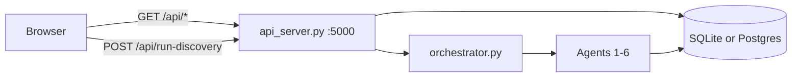

# NeuroDiscover Dashboard

Single-page UI: `neurodiscover/frontend/index.html` (vanilla HTML/CSS/JS, no build step).

## Quick start

```bash
cd neurodiscover
make dashboard
```

Opens **http://127.0.0.1:8080** in your default browser (`--no-browser` to skip). Press **Ctrl+C** to stop API + UI.

Details: [`../../neurodiscover/frontend/QUICKSTART.md`](../../neurodiscover/frontend/QUICKSTART.md).

## Data flow

**Default (no browser Supabase keys):** UI → FastAPI (`api_server.py` :5000) → SQLite or team Postgres (`SUPABASE_DATABASE_URL` on the server only).

**Optional:** set `SUPABASE_URL` + `SUPABASE_ANON_KEY` in the page or `localStorage` for direct read-only Supabase queries (parallel to the API).



## UI layout

| Area | Content |
|------|---------|
| Header | DB status, evidence totals, synthetic cohort badge, run id |
| KPI strip + summary bar | Per-type counts; **this run** vs **in database** after a pipeline run |
| Run status strip | Ready / Running / Complete / Partial / Failed |
| **Step 1** | Configure & run — mode, max papers, extraction, pull options |
| **Step 2** | Results — pipeline diagram, synthetic cohort, ranked outputs, hypotheses, audit trace, evidence table |

Timestamps display in **US Eastern** (`America/New_York`, labeled EST or EDT).

## API reads (no browser keys)

| Panel | Route |
|-------|--------|
| DB / KPI tiles | `GET /api/stats` |
| Subgroups / connections | `GET /api/discover/parkinsons` |
| Recommendations | `GET /api/recommendations?run_id=` |
| Recent runs | `GET /api/runs` |
| Per-run counts | `GET /api/run-stats?run_id=` |
| Agent trace | `GET /api/agents?run_id=` |
| Evidence table | `GET /api/evidence?offset=&limit=` |
| Synthetic patients | `GET /api/synthetic-cohort?run_id=` or included in run response |

## Pipeline run

| Action | Endpoint |
|--------|----------|
| Demo / scan / full | `POST /api/run-discovery` |

Body (example): `{ "mode": "demo", "max_papers": 5, "query": null, "with_fulltext": false, "pull_grants": true }`

Response includes: `run_id`, `recommendations`, `agent_outputs` (alias `steps`), `synthetic_cohort`, `runStats` (processed vs database totals).

Orchestrator behavior (unchanged):

- **demo / scan** — literature via `cli.py` subprocess, then agents 2–6 in-process
- **full** — `literature_agent.run()` (+ optional grants), then agents 2–6

Demo mode caps literature rows used by downstream agents to `max_papers`.

## Synthetic cohort

`generate_synthetic_cohort(run_id)` builds **Patients A–E** from `recommendations` + `subgroups`. Not stored in the DB. Every profile is labeled synthetic / no PHI.

## Confidence

```
confidence = evidence_strength × 0.55 + commercial_potential × 0.45
```

| Tier | Rule |
|------|------|
| Prioritize | ≥ 80 |
| Monitor | 65–79 |
| Reject | < 65 |

## Related docs

- JSON contracts: [Backend queries](backend-queries)
- Endpoint list: [API endpoints](api-endpoints)
- Agent I/O: [Agent I/O](agent-io)
- Mockup notes (archived): [`../../neurodiscover/frontend/MOCKUP_V2.md`](../../neurodiscover/frontend/MOCKUP_V2.md)
