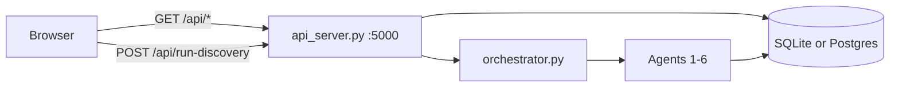

# NeuroDiscover Dashboard

Single-page UI: `neurodiscover/frontend/index.html` (vanilla HTML/CSS/JS, no build step).

## Quick start

Requires **Python 3.10, 3.11, or 3.12**.

```bash
git clone https://github.com/kahinimehta/Quorum.git
cd Quorum/neurodiscover
pip install -r requirements.txt   # or: conda env create -f environment.yml && conda activate neurodiscover
make dashboard
```

Opens **http://127.0.0.1:8080** in your default browser (`--no-browser` to skip). Press **Ctrl+C** to stop API + UI.

With **team Supabase** (`SUPABASE_DATABASE_URL` in `.env`), the same command skips `build` and runs **agents-only** before serving so connections and recommendations are populated on first load.

Details: [`../../neurodiscover/frontend/quickstart.md`](../../neurodiscover/frontend/quickstart.md).

## Data flow

**Default (no browser Supabase keys):** UI → FastAPI (`api_server.py` :5000) → SQLite or team Postgres (`SUPABASE_DATABASE_URL` on the server only).

**Optional:** set `SUPABASE_URL` + `SUPABASE_ANON_KEY` in the page or `localStorage` for direct read-only Supabase queries (parallel to the API).



## UI layout

| Area | Content |
|------|---------|
| Header | DB status, evidence totals, synthetic cohort badge, run id |
| KPI strip + summary bar | Per-type counts; **this run** vs **in database** after a pipeline run |
| Run status strip | Ready / Running / Complete / Partial / Failed |
| **Agent pipeline stepper** | One agent **Running…** at a time during a run; **Done** / **Waiting…** for others; polls `GET /api/agents?run_id=` (~500ms) for stepper UI and `GET /api/run-discovery/status?run_id=` for completion |
| **Step 1** | Configure & run — pipeline mode (Rescore / Demo / Incremental / Full), disease, max papers, extraction; single run button |
| **Step 2** | Results — pipeline diagram, synthetic cohort, ranked outputs, hypotheses, audit trace, evidence table |
| **Step 3** | Static CUA grant proposal — bundled `graded6` demo inlined (not run-scoped) |

Timestamps display in **US Eastern** (`America/New_York`, labeled EST or EDT).

## API reads (no browser keys)

| Panel | Route |
|-------|--------|
| DB / KPI tiles | `GET /api/stats` |
| Subgroups / connections | `GET /api/discover/parkinsons` (legacy path; indication-agnostic) |
| Recommendations | `GET /api/recommendations?run_id=` |
| Recent runs | `GET /api/runs` |
| Per-run counts | `GET /api/run-stats?run_id=` |
| Agent trace | `GET /api/agents?run_id=` |
| Run completion | `GET /api/run-discovery/status?run_id=` |
| Evidence table | `GET /api/evidence?offset=&limit=` |
| Synthetic patients | `GET /api/synthetic-cohort?run_id=` or included in run response |
| CUA demo (Step 3) | `GET /api/cua/demo` · report `GET /cua-demo/graded6.html` |

## Pipeline run

| Action | Endpoint |
|--------|----------|
| Demo / scan / full / agents-only | `POST /api/run-discovery` |

Body (example): `{ "mode": "demo", "run_id": "abc12345", "max_papers": 10, "disease": "Parkinson's", "query": null, "with_fulltext": false, "pull_grants": true }`

Response includes: `run_id`, `recommendations`, `agent_outputs` (alias `steps`), `synthetic_cohort`, `runStats` (processed vs database totals).

Orchestrator modes (all run literature **in-process** with the client `run_id` for live stepper commits):

- **demo** — offline seeded evidence; trace: `Demo mode: using N of M…`
- **scan** — incremental pull; trace: `Starting incremental scan…` → `Incremental scan complete: stored N new…`
- **full** — live PubMed + trials (+ optional preprints, full text, grants); trace: `Starting full live pull…` → `Full live pull complete: stored N new…`
- **agents-only** — no literature pull; trace: `Agents-only: using N of M…`

`GET /api/runs` returns `mode` (API slug) and **`modeLabel`** (UI string). **`evidenceNote`** is mode-specific — incremental runs include `incremental` and skip counts; full runs list papers/trials stored.

`runStats` includes **`modeLabel`** alongside `mode`.

## Scoring (agents 4–5)

Evidence and commercial scores **scale with per-connection evidence count** (see [Evidence Scoring](../workflow/evidence-scoring) and [Commercial Discovery](../workflow/commercial-discovery)). Stored columns are 0–100; `recommendations.confidence` uses the same formula as the dashboard.

## Synthetic cohort

`generate_synthetic_cohort(run_id)` builds **Patients A–E** from `recommendations` + `subgroups`. Not stored in the DB. Every profile is labeled synthetic / no PHI.

## Confidence

```
confidence = evidence_strength × 0.55 + commercial_potential × 0.45
```

| Tier | Rule |
|------|------|
| Prioritize | ≥ 80 |
| Monitor | 65–79 |
| Reject | < 65 |

## Related docs

- JSON shapes: [Backend queries](backend-queries)
- Endpoint list: [API endpoints](api-endpoints)
- Agent I/O: [Agent I/O](agent-io)
- Mockup notes (archived): [`../../neurodiscover/frontend/mockup-v2.md`](../../neurodiscover/frontend/mockup-v2.md)
