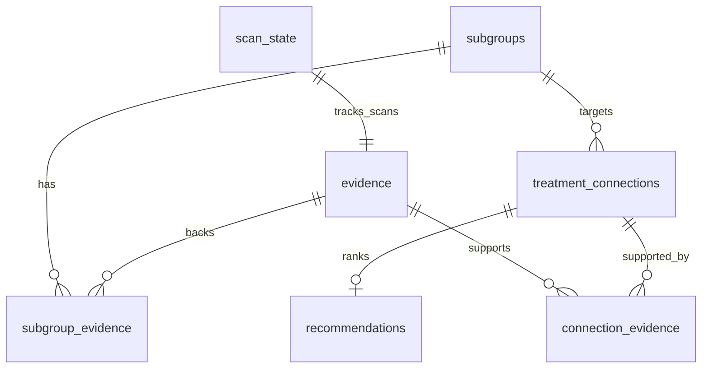

# Database Contract — NeuroDiscover (Quorum)

**Owner:** Person 3 (Ayelet, Data Engineer)  
**Schema source of truth:** [`schema.sql`](../../neurodiscover/schema.sql) (SQLite) and [`schema.pg.sql`](../../neurodiscover/schema.pg.sql) (Postgres)  
**Team shared DB:** [Supabase](supabase) (free Postgres) — set `SUPABASE_DATABASE_URL` in `.env`

## Where the database lives

| Mode | When | How |
|------|------|-----|
| **Supabase** (recommended for team) | `SUPABASE_DATABASE_URL` is set | All agents + Person 2 API use one hosted Postgres |
| **Local SQLite** | URL unset | `neurodiscover.db` next to `cli.py` — offline / solo dev |

Same table names in both modes. **Table is `evidence`, not `papers`.**

## SQLite vs MongoDB (working doc)

The working doc mentions MongoDB. **Use Supabase Postgres or local SQLite** with this schema — not a separate `papers` collection. Person 2: see [Person 2 backend](person2-backend).

## Entity relationship



## Tables

### `evidence` — one row per source (Agent 1 writes)

Manuscripts, trials, and grants share this table via `source_type`.

| Column | Type | Writer | Reader | Notes |
|--------|------|--------|--------|-------|
| `evidence_id` | INTEGER PK | DB | all agents, backend | Internal id |
| `source_type` | TEXT | Agent 1 | all | `literature` \| `trial` \| `grant` |
| `source_id` | TEXT | Agent 1 | all, dashboard | PMID / DOI / NCT id / grant num |
| `title` | TEXT | Agent 1 | backend, dashboard | |
| `year` | INTEGER | Agent 1 | Agent 4 (skeptic) | |
| `venue` | TEXT | Agent 1 | dashboard | Journal or ClinicalTrials.gov |
| `subgroup` | TEXT | Agent 1 | Agents 2–3 | Free-text tag; prefer seeded names |
| `mechanism` | TEXT | Agent 1 | Agents 3–6 | |
| `treatment` | TEXT | Agent 1 | Agents 3–6 | |
| `key_result` | TEXT | Agent 1 | all | 1–2 sentence distilled finding |
| `study_type` | TEXT | Agent 1 | dashboard, future weighting | in vitro / mouse / cohort / RCT / Phase 2 … |
| `sample_size` | INTEGER | Agent 1 | dashboard, future weighting | Populated on trials; optional on literature |
| `evidence_snippet` | TEXT | Agent 1 | dashboard | ≤15 word citation line |
| `url` | TEXT | Agent 1 | dashboard | PubMed or ClinicalTrials.gov link |
| `doi` | TEXT | Agent 1 | backend | Secondary stable id |
| `access_status` | TEXT | Agent 1 | Agent 4, dashboard | `open` \| `abstract_only` \| `restricted` \| `error` \| `unknown` (synced from `access_type`) |
| `abstract` | TEXT | Agent 1 | Agent 4 | Full abstract from PubMed/BioMCP |
| `methods_text` | TEXT | Agent 1 | **Agent 4** | Methods excerpt (~2k chars) when OA full text fetched |
| `results_text` | TEXT | Agent 1 | **Agent 4** | Results excerpt |
| `discussion_text` | TEXT | Agent 1 | **Agent 4** | Discussion excerpt (~1k chars) |
| `access_type` | TEXT | Agent 1 | Agent 4 | `published_oa` \| `published_paywalled` \| `preprint` \| `error` \| `unknown` |
| `full_text_url` | TEXT | Agent 1 | dashboard | OA / preprint full-text link |
| `is_preprint` | INTEGER/BOOLEAN | Agent 1 | Agent 4 | `1`/`true` for bioRxiv preprints |
| `publication_year` | INTEGER | Agent 1 | Agent 4 | Explicit year from pull (mirrors `year`) |
| `pulled_at` | TEXT | DB default | backend | First insert time |
| `last_scanned_at` | TEXT | Agent 1 | scan logic | Updated on incremental scan hits |

**Light processing (Agent 1):** LLM extracts `subgroup`, `mechanism`, `treatment`, `key_result`, `evidence_snippet`. Agents 4–5 score from evidence counts and source types in current code (not `study_type` / `sample_size` columns directly).

**Existing DBs:** run migrations in order:
1. [`../../neurodiscover/migrations/001_evidence_light_processing.sql`](../../neurodiscover/migrations/001_evidence_light_processing.sql)
2. [`../../neurodiscover/migrations/002_evidence_mcp_metadata.sql`](../../neurodiscover/migrations/002_evidence_mcp_metadata.sql)

Or `python3 cli.py build` locally for a fresh SQLite DB.

See [Literature pull](literature-pull) for two-stage pull details.

**Dedup:** `UNIQUE(source_type, source_id)` — re-pulls insert with `INSERT OR IGNORE`.

**Demo ids:** Seed uses `DEMO-*` placeholders. Live pull replaces with real PMIDs/NCT ids. Never present DEMO ids as real to judges.

### `subgroups` — Agent 2 writes (seed pre-populates demo)

| Column | Writer | Notes |
|--------|--------|-------|
| `name` | Agent 2 | UNIQUE, e.g. `GBA-mutation PD` |
| `defining_features` | Agent 2 | |
| `notes` | Agent 2 | optional |

### `treatment_connections` — Agent 3 writes; Agents 4–5 update scores

| Column | Writer | Notes |
|--------|--------|-------|
| `subgroup_id` | Agent 3 | FK → subgroups |
| `mechanism` | Agent 3 | |
| `treatment` | Agent 3 | UNIQUE per (subgroup_id, treatment) |
| `evidence_strength` | Agent 4 | 0–100 |
| `commercial_potential` | Agent 5 | 0–100 |

### Join tables

- **`subgroup_evidence`** — links evidence to subgroups (Agent 1 auto-links on name match; seed loader fills demo)
- **`connection_evidence`** — links evidence to treatment connections (Agent 3)

### `agent_outputs` — every agent appends one row per run step

Dashboard reads this for the agent trace.

### `recommendations` — Agent 6 writes

`confidence = evidence_strength * 0.55 + commercial_potential * 0.45`  
`tier`: `Prioritize` (≥80) \| `Monitor` (65–79) \| `Reject` (<65)

### `scan_state` — singleton (Agent 1)

| Column | Purpose |
|--------|---------|
| `disease` | Last scanned disease query |
| `last_scan_at` | Timestamp of last successful scan |
| `last_run_id` | Links to `agent_outputs.run_id` |

## MongoDB field mapping (Person 2)

If mirroring to MongoDB, use these names:

| SQLite `evidence` | Suggested Mongo field |
|-------------------|----------------------|
| `evidence_id` | `_evidenceId` or omit (use `source_type`+`source_id` as key) |
| `source_type` | `sourceType` |
| `source_id` | `sourceId` |
| `key_result` | `keyResult` |
| `study_type` | `studyType` |
| `sample_size` | `sampleSize` |
| `evidence_snippet` | `evidenceSnippet` |
| `access_status` | `accessStatus` |
| `last_scanned_at` | `lastScannedAt` |

Collection name: **`evidence`** (not `papers`).

## Commands

Run from the `neurodiscover/` package directory:

```bash
cd neurodiscover
python3 cli.py build      # rebuild from schema + seed
python3 cli.py validate   # FK / schema checks
python3 cli.py show       # row counts
python3 cli.py pull       # full BioMCP + Nebius backfill
python3 cli.py scan --max 5   # incremental low-cost scan
python3 cli.py demo       # offline safe demo path
```

## Team collaboration — where the database lives

SQLite is the blackboard, but **each developer keeps their own local file**.

| Artifact | In git? | Notes |
|----------|---------|-------|
| `neurodiscover/schema.sql` | Yes | Team contract — never diverge silently |
| `neurodiscover/seed_data.json` | Yes | Reproducible demo; everyone runs `cli.py build` |
| `neurodiscover/neurodiscover.db` | **No** (`.gitignore`) | Built locally; do not commit or merge binary DBs |
| Optional demo snapshot | Rarely, `demo` branch only | Judge backup if APIs fail — prefer seed + pre-pull |

**Simultaneous work rules:**

- **Do not** point multiple laptops at one shared `.db` on Google Drive, NFS, or git LFS — concurrent writes corrupt SQLite.
- **Do** run agents sequentially on one machine (Agent 1 → 6) against one DB file.
- **Parallel dev:** set a private DB path per person:
  ```bash
  export NEURODISCOVER_DB=/tmp/alice-neurodiscover.db
  cd neurodiscover && python3 cli.py build
  ```
- **Live literature pulls:** coordinate so one person runs `pull`/`scan`; others use `build` + seed or copy a announced DB path once (read-only).

`PRAGMA journal_mode=WAL` is enabled for multiple **readers** on the same machine (e.g. backend + agent); it does not fix multi-writer across machines.

## Continuous scan (minimal cost)

Cost driver is **Nebius LLM**, not BioMCP (free).

1. Cron every 6h: `0 */6 * * * cd /path/to/Quorum/neurodiscover && python3 cli.py scan --max 5`
2. Scan skips LLM for existing `(source_type, source_id)` — only updates `last_scanned_at`
3. New hits: fetch abstract (free) → LLM extract once → INSERT
4. Use cheap model in `.env`: `NEBIUS_MODEL=nvidia/NVIDIA-Nemotron-3-Nano-30B-A3B`

## Do not change without team sync

Renaming columns or tables requires notifying **Person 2 (backend)** and **Person 4 (agents)**. The schema is the team contract.
