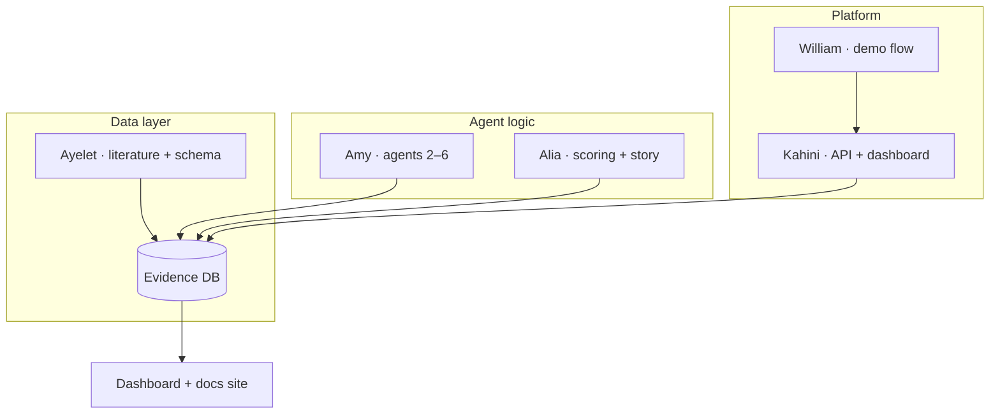

# Team

**Quorum** · NeuroDiscover AI · NextGen BioAgents Hackathon · Final Showcase June 6, 2025

---

## Collaboration at a glance

| Member | Domain | Project contribution |
|--------|--------|----------------------|
| **Alia Merchant** | Strategy · commercialization | Product framing, stakeholder story, downstream agents, demo readiness |
| **Amy He** | ML · agent infrastructure | Discovery agents, scoring logic, commercial signals, agent patterns |
| **Ayelet Peres** | Computational biology · data | Literature Agent, ingestion, schema, Supabase, validation |
| **Kahini Mehta** | Neuroscience · engineering | Database contract, orchestrator, API, dashboard, integration |
| **William Yakah** | Workflow · agentic UX | Demo narrative, cross-agent usability, workflow design |

{: .highlight }
**Interdisciplinary mix:** life sciences + ML + strategy + full-stack engineering — each role maps to a distinct agent or platform layer in the shipped system.

---

## Alia Merchant

**Commercialization · Strategy**

Healthcare and life sciences strategist with an MBA and MSIT. Brings a business and venture lens (Harvard BioVenture, Nucleate finalist, Enventure first-place winner) and HSIL Hackathon 2026 experience. The team's commercialization and strategy voice.

**On this project:** Product framing, Pfizer-track problem narrative, downstream agent ownership (subgroups, connections, scoring), API alignment with dashboard consumers, and demo readiness.

---

## Amy He

**Agents · ML · Infrastructure**

Research scientist at Topos Bio (SF) working on foundation model development and application in drug discovery, with a background in AI/ML and biochemistry. Heavy daily user of Codex and Claude Code, focused on agent infrastructure for observability and semantic layer engineering.

**On this project:** Downstream discovery agents, agent design patterns, conclusion/recommendation logic, and commercial signal integration.

---

## Ayelet Peres

**Literature · Data infrastructure**

Postdoc at Yale School of Medicine in computational immunology, immunogenomics, and AI. Works on immune receptor genomics, large-scale biological datasets, and tools that make complex data easier to analyze.

**On this project:** Literature Synthesis Agent (Agent 1), PubMed/trials ingestion, schema, Supabase setup, and validation patterns.

---

## Kahini Mehta

**Data · Dashboard · Pipeline**

Third-year PhD student in Columbia's Neurobiology and Behavior program working with human single-neuron and MRI data. Focus on analysis pipelines and computational modeling using Bayesian and machine learning methods. Passionate about open science and reproducibility.

**On this project:** Database contract, orchestrator, FastAPI backend, dashboard UI, synthetic cohort layer, and integration testing.

---

## William Yakah

**Agentic workflows**

Fifth-year PhD student in Nutritional and Metabolic Biology studying maternal-to-fetal cholesterol transport and fetal neurodevelopment. Co-founder of **LabShare**, a platform connecting researchers to institutional resources (live at Columbia and elsewhere).

**On this project:** Workflow ideas, demo narrative, and cross-agent usability.

---

## How we worked together

- **Contract-first:** `schema.sql` + `developer-reference/agent-io.md` before agent code diverged  
- **Shared `run_id`:** every agent appends to `agent_outputs` for audit  
- **Safe demo path:** offline seed + synthetic cohort agreed early for showcase reliability  
