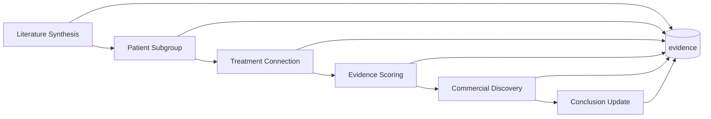

# Workflow

Six agents run in order. Each reads prior tables and writes its own — the **database is the blackboard**.

---

## Pipeline overview

<div class="flow">
  <span class="flow-box">① Literature</span>
  <span class="flow-arrow">→</span>
  <span class="flow-box">② Subgroups</span>
  <span class="flow-arrow">→</span>
  <span class="flow-box">③ Connections</span>
  <span class="flow-arrow">→</span>
  <span class="flow-box">④ Evidence score</span>
  <span class="flow-arrow">→</span>
  <span class="flow-box">⑤ Commercial</span>
  <span class="flow-arrow">→</span>
  <span class="flow-box">⑥ Conclusions</span>
</div>



| # | Agent | Reads | Writes |
|---|-------|-------|--------|
| 1 | [Literature Synthesis](literature-synthesis) | PubMed, bioRxiv, trials, grants | `evidence`, `subgroup_evidence`, `scan_state` |
| 2 | [Patient Subgroup](patient-subgroup) | `evidence` | `subgroups` |
| 3 | [Treatment Connection](treatment-connection) | `subgroups`, `evidence` | `treatment_connections`, `connection_evidence` |
| 4 | [Evidence Scoring](evidence-scoring) | connections + evidence | `evidence_strength` |
| 5 | [Commercial Discovery](commercial-discovery) | scored connections (in-memory) | `commercial_potential` (via orchestrator) |
| 6 | [Conclusion Update](conclusion-update) | scored connections | `recommendations` |

**Agent 1** appends its own `agent_outputs` rows. **Agents 2–6** run in-process; the **orchestrator** (`orchestrator.py`) persists SQL writes and logs `agent_outputs` (step_order 2–6).

---

## Run modes

| Mode | Behavior | When to use |
|------|----------|-------------|
| **demo** | Subprocess `cli.py demo`, then agents 2–6; **`max_papers` caps rows for agents 2–6** | Stage demos, offline judging |
| **scan** | Subprocess `cli.py scan` (incremental; PubTator skipped); agents 2–6 use **all** subgroup evidence in DB | Low-cost updates |
| **full** | In-process `literature_agent.run()` + optional `pull-grants` (up to 30 grants); agents 2–6 use **all** subgroup evidence in DB | Live data refresh |

`include_preprints`, `with_fulltext`, and `extract_backend` apply to **full** mode (and `pull`/`full` literature paths). **Scan/demo** subprocess calls ignore preprints/fulltext API flags.

Orchestrator entry: `neurodiscover/orchestrator.py` via `POST /api/run-discovery`.

- **demo / scan** — literature via `cli.py` subprocess, then agents 2–6 in-process
- **full** — `literature_agent.run()` (+ optional grants), then agents 2–6

---

## Run status

| Status | Rule |
|--------|------|
| **Complete** | All six agents in trace and ≥1 recommendation — or ≥5 recommendations with partial trace (see `run_status.py`) |
| **Partial** | Fewer than six agents and/or no recommendations — UI shows e.g. `3/6` |
| **Failed** | Uncaught exception in orchestrator |

---

## Scoring formula

Used by Agent 6 when writing `recommendations`:

```
confidence = evidence_strength × 0.55 + commercial_potential × 0.45
```

Agents 4 and 5 compute **0–10** scores in Python; the orchestrator stores **0–100** on `treatment_connections` (×10). `recommendations.confidence` uses the stored 0–100 values (displayed as 0–100 in the API).

---

## Related

- [Inputs](input) — SQL reads and API request bodies
- [Output examples](output) — JSON responses
- [Agent I/O](developer-reference/agent-io) — full SQL for developers
