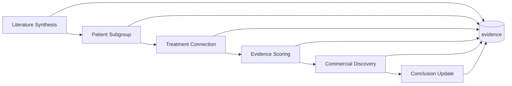

# Workflow

Six agents run in order. Each reads prior tables and writes its own — the **database is the blackboard**.

---

## Pipeline overview

<div class="flow">
  <span class="flow-box">① Literature</span>
  <span class="flow-arrow">→</span>
  <span class="flow-box">② Subgroups</span>
  <span class="flow-arrow">→</span>
  <span class="flow-box">③ Connections</span>
  <span class="flow-arrow">→</span>
  <span class="flow-box">④ Evidence score</span>
  <span class="flow-arrow">→</span>
  <span class="flow-box">⑤ Commercial</span>
  <span class="flow-arrow">→</span>
  <span class="flow-box">⑥ Conclusions</span>
</div>



| # | Agent | Reads | Writes |
|---|-------|-------|--------|
| 1 | [Literature Synthesis](literature-synthesis) | PubMed, bioRxiv, trials, grants | `evidence`, `subgroup_evidence`, `scan_state` |
| 2 | [Patient Subgroup](patient-subgroup) | `evidence` | `subgroups` |
| 3 | [Treatment Connection](treatment-connection) | `subgroups`, `evidence` | `treatment_connections`, `connection_evidence` |
| 4 | [Evidence Scoring](evidence-scoring) | connections + evidence | `evidence_strength` |
| 5 | [Commercial Discovery](commercial-discovery) | connections; Tavily / RePORTER | `commercial_potential` |
| 6 | [Conclusion Update](conclusion-update) | scored connections | `recommendations` |

Every agent also appends to `agent_outputs` with a shared `run_id`.

---

## Run modes

| Mode | Behavior | When to use |
|------|----------|-------------|
| **demo** | Uses seeded evidence; caps rows with `max_papers` | Stage demos, offline judging |
| **scan** | Incremental literature via BioMCP; skips LLM for known `source_id`s | Low-cost updates |
| **full** | Live pull + optional grants | Pre-hackathon data refresh |

Orchestrator entry: `neurodiscover/orchestrator.py` via `POST /api/run-discovery`.

- **demo / scan** — literature via `cli.py` subprocess, then agents 2–6 in-process
- **full** — `literature_agent.run()` (+ optional grants), then agents 2–6

---

## Run status

| Status | Rule |
|--------|------|
| **Complete** | All six agents logged for `run_id` and ≥1 recommendation |
| **Partial** | Missing agents or no recommendations — UI shows e.g. `3/6` |
| **Failed** | Uncaught exception in orchestrator |

---

## Scoring formula

Used by Agent 6 when writing `recommendations`:

```
confidence = evidence_strength × 0.55 + commercial_potential × 0.45
```

Both scores are on a 0–10 internal scale, displayed as 0–100 confidence in the API.

---

## Related

- [Inputs](input) — SQL reads and API request bodies
- [Output examples](output) — JSON responses
- [Agent I/O contract](AGENT_IO) — full SQL for developers
